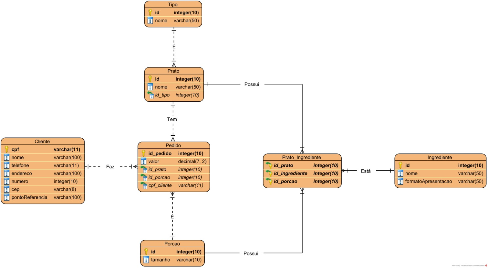
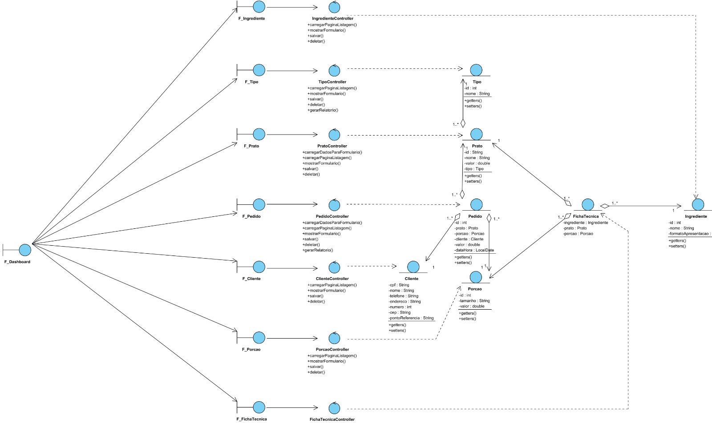

# Avaliação 3 de Laboratório de Banco de Dados (Sistema de Delivery)

## Enunciado
- Considerando o domínio a seguir, montar a modelagem (Diagramas de Classe e ER) para o ambiente ser desenvolvido em Java Web (Obrigatoriamente com Spring Boot, Spring Web e Spring Data JPA).
  - Uma empresa de delivery vende pratos de comidas diversos. Cada prato tem um identificador único gerado aleatoriamente e iniciado pela letra P, além de um nome. Os pratos são cadastrados por tipo e são vendidos em porções, que definem seu valor (pequeno, médio e grande). Todos os pratos são compostos por diversos ingredientes, que tem um identificador único, um nome e um formato de apresentação. Um ingrediente pode aparecer em diversos pratos, mas em porções diferentes. Um cliente pode selecionar vários pratos, de várias porções para compra, mas para finalizar a compra, deve estar cadastrado no sistema por seu CPF, nome, telefone, endereço composto de logradouro, número e CEP, bem como um ponto de referência para entrega. No pedido, além dos pratos que o cliente selecionou, deve-se saber a data de realização. Ao finalizar o pedido, o cliente deve verificar o que foi comprado e o valor total em tela.
- A aplicação deve ter um CRUD (view, model, controller e repository) para cada entidade/objeto definido com suas regras estabelecidas.
- Para os pratos em tela, uma UDF com cursores deve listar os pratos, cada qual com seus ingredientes.
- Deve-se poder gerar um relatório em PDF com os dados dos pratos, ingredientes, porções e valores de um determinado tipo.
- Deve-se poder gerar um relatório em PDF com os dados de um pedido (Com o valor total no cabeçalho), do pedido atual de um cliente.
- Deve-se poder gerar um relatório em PDF com os dados do pratos, ingredientes, porção, valor e cliente de um determinado dia.
- Todas as consultas citadas acima devem estar disponíveis na camada view e tratadas pela camada controller.

## Princípios SOLID do Projeto

A arquitetura deste projeto foi desenhada seguindo os princípios do SOLID para garantir manutenibilidade, escalabilidade e desacoplamento entre as camadas do Spring Boot. Abaixo, detalhamos como cada princípio foi aplicado na prática, considerando as entidades e as funcionalidades implementadas.

### S - Single Responsibility Principle (Princípio da Responsabilidade Única)

"Uma classe deve ter apenas um motivo para mudar."

- No projeto, cada classe possui uma responsabilidade única e bem definida, respeitando a arquitetura em camadas (MVC):

  - Controllers (PedidoController, PratoController): Responsáveis exclusivamente por gerenciar as requisições HTTP/Web, interagir com a View (Thymeleaf) e delegar a lógica de negócios. Eles não contêm regras de validação complexas, não acessam o banco de dados diretamente e não geram arquivos PDF (apenas chamam quem gera).

  - Services (PratoService, PedidoService): Concentram toda a regra de negócio. É aqui que ocorrem as validações, as chamadas de Stored Procedures (como a sp_gera_id_prato) e a orquestração do salvamento de dados.

  - Repositories (PedidoRepository, PratoRepository): Responsáveis apenas pela comunicação com o banco de dados SQL Server, abstraindo a complexidade das queries SQL e chamadas de procedures.

  - DTOs (AtualizacaoPrato, AtualizacaoPedido): Responsáveis apenas por transportar dados entre o formulário (Front-end) e o Backend, isolando a estrutura interna da Entidade JPA da camada de apresentação.

  - Fronteiras: Existe uma subdivisão interna entre algumas Entidades, em que cada html tem uma ação específica dentro do CRUD: O listagem (Read/Delete/Relatório em alguns casos) e o formulário (Create/Update)

### O - Open/Closed Principle (Princípio Aberto/Fechado)

"Entidades de software devem estar abertas para extensão, mas fechadas para modificação."

- O sistema permite adicionar novos comportamentos sem alterar o código fonte dos componentes principais:
  - Extensão de Repositories: Utilizamos interfaces (como Repositorys) que estendem JpaRepository. Adicionamos novas funcionalidades — como a chamada da function nativa findAllViaFunction ou Procedures com @Procedure — criando novos métodos na interface, sem precisar alterar a implementação interna do Spring Data JPA.
  - Relatórios Jasper: A arquitetura de geração de relatórios foi feita de forma modular. Para adicionar um novo relatório (ex: "Vendas por Mês"), basta criar um novo arquivo .jrxml e um novo endpoint no Controller, sem a necessidade de modificar a lógica de conexão com o DataSource ou a estrutura das entidades existentes.

### L - Liskov Substitution Principle (Princípio da Substituição de Liskov)

"Objetos em um programa devem ser substituíveis por instâncias de seus subtipos sem alterar a integridade do programa."

- Este princípio é aplicado através do uso de Contratos (Interfaces) e Polimorfismo:

  - Interface Genérica IService: Definimos a interface IService<T, DTO, ID>, que estabelece o contrato para as operações CRUD (Salvar, Listar, Excluir, Buscar).
  - Implementação: As classes PratoService, PedidoService e PorcaoService implementam esse contrato. Isso garante que, em qualquer lugar do sistema que espere um serviço CRUD padrão, qualquer uma dessas implementações possa ser utilizada, mantendo a consistência comportamental da aplicação e garantindo que métodos como salvarOuAtualizar se comportem de maneira previsível.

### I - Interface Segregation Principle (Princípio da Segregação de Interface)

"Muitas interfaces específicas são melhores do que uma interface única e geral."

- O projeto evita forçar as classes (ou o Front-end) a dependerem de dados ou métodos que não utilizam, criando interfaces específicas para visualizações específicas (Projeções):

  - Projeções JPA (PratoIngredienteView): Para a listagem da "Ficha Técnica", não obrigamos o sistema a carregar a entidade completa PratoIngrediente (que possui relacionamentos pesados e complexos com Prato, Ingrediente e Porção).
  - Aplicação: Criamos uma interface leve (PratoIngredienteView) que expõe apenas os dados necessários para aquela tela (getNomePrato, getIdPrato, etc.). Isso separa a interface de Leitura (View) da interface de Escrita (Entidade/DTO), otimizando a performance e simplificando o uso dos dados no Thymeleaf. O cliente (a View HTML) não precisa conhecer a complexidade da entidade de domínio.

### D - Dependency Inversion Principle (Princípio da Inversão de Dependência)

"Módulos de alto nível não devem depender de módulos de baixo nível. Ambos devem depender de abstrações"

- O desacoplamento entre as camadas é garantido pela Injeção de Dependência do Spring (IoC):
  - Uso de @Autowired: As classes de alto nível (como PedidoController) não instanciam manualmente suas dependências de baixo nível (new PedidoService()). Em vez disso, elas declaram uma dependência que é injetada automaticamente pelo container do Spring. Isso facilita a troca de implementações e a criação de testes unitários (Mocks).
  - Abstração DataSource: Para a geração de relatórios Jasper, injetamos a interface javax.sql.DataSource (uma abstração do JDBC), sem que o controlador precise saber os detalhes concretos da conexão (driver, url, senha) ou se o banco é SQL Server, Oracle ou MySQL. O código depende da abstração de conexão, não da implementação específica do driver.

  - Abstração de Repositories: Os Services dependem das interfaces dos Repositories, e não de uma classe concreta de acesso a dados. O Spring Data cria a implementação concreta (SimpleJpaRepository ou um Proxy) em tempo de execução. Isso significa que a regra de negócio depende de um contrato abstrato de persistência (Como "eu preciso de algo que salve Pratos", por exemplo), e não de como o Hibernate ou o SQL Server realizam essa tarefa fisicamente.
 
## Diagramas

### DIagrama Entidade Relacionamento (DER)

### Diagrama de Classe de Projeto (VCP - Visão de Classes Participantes)

## Telas do Projeto

### Dashboard

### Porções

### Tipos de Pratos

### Ingredientes

### Clientes

### Pratos

### Pedidos

### Fichas Técnicas

## Relatórios

### Tipo de Prato

### Pedido

### Cliente Data

<b> Créditos: [@GustavoPereira-DeV](https://github.com/GustavoPereira-Dev) (Projeto Java) e [@Joaoftito](https://github.com/Joaoftito) (Diagramação/Modelagem, SQL e Relatórios)
